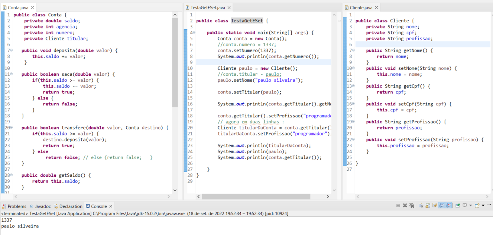

### Curso de Java OO: entendendo a Orientação a Objetos

**Faça esse curso de Java e:**

- Domine o paradigma de programação mais usado no mercado de trabalho

- Entenda o que são referências e objetos

- Use atributos, métodos da instancia e da classe

- Define objetos através de construtores

- Aprenda sobre encapsulamento

Instrutor: [Paulo Silveira](https://www.linkedin.com/in/paulosilveira)

#### Orientação a Objetos

**Instanciação, atributos e referências**

**Nessa aula aprendemos sobre atributos e criação de objetos.**

Vimos:

- O que é uma classe

- Como criar uma classe

- Como criar um objeto ou instância de uma classe

- O que são atributos

- Como definir e visualizar valores de atributos

- Como funciona a atribuição de uma referência à uma variável

Vamos ver mais sobre as classes na próxima aula! Agora não só suas características mas também seu comportamento. Vamos que só está no começo! Espero você lá!

**Referências vs Objetos**

**Referências**

### 03. Definindo comportamento

**Métodos com retorno e Métodos com referência**

**Nessa aula falamos sobre o comportamento que são os métodos.**

Vimos:

- como definir métodos com parâmetros e retorno

- como retornar algo usando a palavra chave return

- como usar a referência this para acessar um atributo

- que podemos passar uma referência como parâmetro do método

- métodos são chamadas a partir da referência usando o operador.

### Composição de objetos

**Aprendemos neste capítulo:**

- Realizar o relacionamento entre classes através de composição;

- Vantagens de se isolar informações repetidas em outra classe;

- Detalhes da composição;

- NullPointerException para atributos não inicializados e seus cuidados.

### Encapsulamento e visibilidade 

**Aprendemos nesta aula:**

- Atributos privados, restringindo o acesso aos atributos

- Encapsulamento de código

- Métodos de leitura dos atributos, os getters

- Métodos de modificação dos atributos, os setters

- Getters e Setters de referência

**Encapsulamento e visibilidade**

### Construtores e membros estáticos

